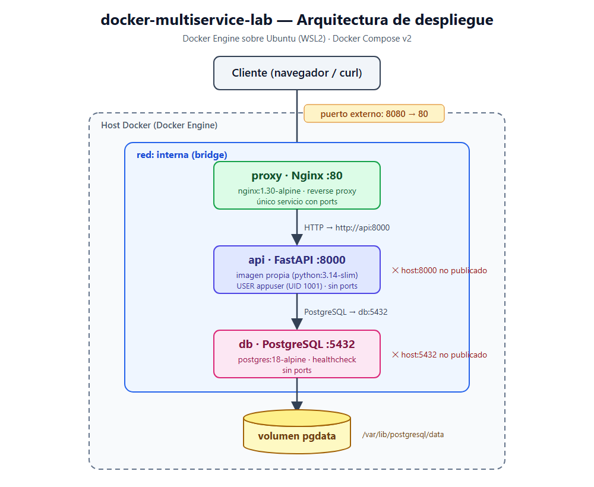

# Docker Multiservice Lab

[](https://github.com/articulacionTics/docker_SENA/actions/workflows/publicar-imagen.yml)

## Descripción

Proyecto integrador de la guía SENA **«Despliegue de aplicaciones y servicios en contenedores Docker»**: programa 22810024, competencia 220501086 (RA1 y RA2).

Es una aplicación web multiservicio, deliberadamente sencilla, desplegada con **Docker Engine** y **Docker Compose**:

- un **reverse proxy Nginx**, único punto de entrada;
- una **API FastAPI**, con imagen propia construida mediante un Dockerfile multi-etapa y ejecutada sin privilegios;
- una base de datos **PostgreSQL** con datos persistentes en un volumen.

La imagen de la API se publica automáticamente en **GHCR** con **GitHub Actions** cada vez que un cambio llega a `main`.

## Arquitectura



| Servicio | Imagen | Puerto interno | Puerto en el host | Función |
|---|---|---:|---:|---|
| `proxy` | `nginx:1.30-alpine` | 80 | **8080** | Reverse proxy hacia `http://api:8000` |
| `api` | `api-app:1.0.0` (base `python:3.14-slim`, multi-etapa, UID 1001) | 8000 | — | Backend FastAPI |
| `db` | `postgres:18-alpine` | 5432 | — | Base de datos (volumen `pgdata`) |

Los tres servicios están en la red bridge `interna` y se encuentran por **nombre de servicio**. Solo el proxy publica un puerto; la API y la BD no son accesibles desde el host.

## Tecnologías

Docker Engine 29 · Docker Compose (plugin `docker compose`) · Python 3.14 · FastAPI · Uvicorn · psycopg 3 · PostgreSQL 18 · Nginx 1.30 · GitHub Actions · GitHub Container Registry (GHCR)

## Requisitos

| Recurso | Mínimo |
|---|---|
| RAM | 4 GB (la solución consume ≈ 81 MiB en reposo, ver `docs/pruebas.md` P9) |
| Disco libre | 15 GB |
| CPU | 64 bits con virtualización habilitada (VT-x / AMD-V) o Apple Silicon |
| Software | **Docker Engine 29.x** con el plugin Compose, y Git. **No se usa Docker Desktop.** |
| Puerto libre | 8080 en el host |

La matriz completa de requisitos de infraestructura (RI-01…RI-15, RI-OS-01…03) está en [`docs/requisitos.md`](docs/requisitos.md).

## Instalación del motor

En los tres sistemas operativos se termina usando **el mismo Docker Engine y los mismos comandos**; lo único que cambia es cómo se obtiene el núcleo Linux. En [`docs/entorno.md`](docs/entorno.md) está documentada la instalación real del equipo (Windows 11 + WSL2), con sus salidas y los problemas resueltos.

### Ubuntu 22.04 / 24.04 / 26.04 (nativo)

```bash
sudo apt remove -y docker.io docker-compose docker-compose-v2 docker-doc podman-docker
sudo apt update && sudo apt install -y ca-certificates curl
sudo install -m 0755 -d /etc/apt/keyrings
sudo curl -fsSL https://download.docker.com/linux/ubuntu/gpg -o /etc/apt/keyrings/docker.asc
sudo chmod a+r /etc/apt/keyrings/docker.asc
sudo tee /etc/apt/sources.list.d/docker.sources > /dev/null <<EOF
Types: deb
URIs: https://download.docker.com/linux/ubuntu
Suites: $(. /etc/os-release && echo "${UBUNTU_CODENAME:-$VERSION_CODENAME}")
Components: stable
Architectures: $(dpkg --print-architecture)
Signed-By: /etc/apt/keyrings/docker.asc
EOF
sudo apt update
sudo apt install -y docker-ce docker-ce-cli containerd.io docker-buildx-plugin docker-compose-plugin
sudo systemctl enable --now docker
sudo usermod -aG docker $USER      # cerrar sesión y volver a entrar
```

> Use `apt remove`, **no** `apt purge docker.io`: la purga borra `/var/lib/docker`, con todas las imágenes, contenedores y volúmenes (`docs/entorno.md`, P7).

### Windows 10 v2004+ / Windows 11 (WSL2)

En **PowerShell como Administrador**:

```powershell
wsl --install --no-distribution
wsl --update
wsl --set-default-version 2
wsl --install -d Ubuntu-24.04 --web-download
wsl --set-default Ubuntu-24.04
```

Dentro de **Ubuntu**, active systemd y luego instale Docker Engine con los mismos comandos de la sección de Ubuntu:

```bash
printf '[boot]\nsystemd=true\n' | sudo tee /etc/wsl.conf
```

Después, en PowerShell, ejecute `wsl --shutdown` y vuelva a abrir Ubuntu. Desde ahí: **docker, git y el proyecto se usan siempre dentro de Ubuntu**, y PowerShell solo para los comandos `wsl`. Abra `http://localhost:8080` en el navegador de Windows: WSL2 reenvía el puerto.

### macOS 13+ (Intel o Apple Silicon) con Colima

```bash
brew install docker docker-compose colima
mkdir -p ~/.docker
colima start --cpu 2 --memory 4 --disk 20
```

Registre el plugin de Compose en `~/.docker/config.json`: `{ "cliPluginsExtraDirs": ["/opt/homebrew/lib/docker/cli-plugins"] }`. En Mac Intel la ruta es `/usr/local/lib/docker/cli-plugins`. Colima no arranca sola: ejecute `colima start` tras cada reinicio. Las tres imágenes base publican variante arm64.

### Verificar el motor (los tres sistemas)

```bash
docker --version             # serie 29 o superior
docker compose version
docker context ls            # el asterisco debe estar en "default"
docker run --rm hello-world  # "Hello from Docker!"
```

## Instalación del proyecto

```bash
git clone https://github.com/articulacionTics/docker_SENA.git
cd docker_SENA
cp .env.example .env
```

## Configuración

`.env` **no se versiona** (está en `.gitignore`). `.env.example` contiene las mismas claves con valores ficticios.

| Variable | Ejemplo | Uso |
|---|---|---|
| `DB_NAME` | `appdb` | Base de datos que crea PostgreSQL y que usa la API |
| `DB_USER` | `postgres` | Usuario de PostgreSQL |
| `DB_ADMIN_PASSWORD` | `cambiar_esta_clave` | Contraseña de PostgreSQL. **Cámbiela** fuera del laboratorio |
| `DB_HOST` | `db` | Host de la BD para la API: el nombre del servicio, nunca `localhost` |
| `DB_PORT` | `5432` | Puerto interno de PostgreSQL |

## Ejecución

```bash
docker compose up -d --build
```

Compose construye la imagen de la API y arranca **db**. Cuando db está *healthy* arranca **api**, y cuando api está *healthy* arranca **proxy**. Tarda unos 30 a 40 segundos la primera vez.

## Verificación

```bash
docker compose ps
```

Resultado esperado: tres servicios `Up`; `db` y `api` con `(healthy)`; solo `proxy` con `0.0.0.0:8080->80/tcp`.

```bash
curl http://localhost:8080/health
```

```json
{"status":"ok"}
```

```bash
curl http://localhost:8080/api/status
```

```json
{"api":"ok","database":"connected","db_host":"db","db_ip":"172.18.0.2","db_name":"appdb","postgres_version":"18.6", "...": "..."}
```

| Endpoint (a través de `localhost:8080`) | Descripción |
|---|---|
| `GET /health` | Estado del proceso de la API |
| `GET /api/status` | Resuelve `db` en la red interna y consulta PostgreSQL |
| `GET /api/notas` / `POST /api/notas` `{"texto": "..."}` | Datos de ejemplo para la prueba de persistencia |
| `GET /docs` | Documentación interactiva (OpenAPI) |

Otras comprobaciones: `docker compose exec api id` → `uid=1001(appuser)`; `docker compose logs -f api`; `docker stats`. Todas las pruebas con sus salidas están en [`docs/pruebas.md`](docs/pruebas.md).

## Detener servicios

```bash
docker compose down        # elimina los contenedores y la red; CONSERVA los datos
docker compose down -v     # elimina también el volumen: BORRA los datos
```

## Persistencia

PostgreSQL guarda sus datos en el volumen nombrado `pgdata` (`docker-sena_pgdata`), montado en `/var/lib/postgresql`. Esa es la ruta oficial para PostgreSQL 18+: la clásica `/var/lib/postgresql/data` hace fallar el contenedor (`docs/imagenes.md` §4). Los datos sobreviven a `docker compose down` + `up -d` (`docs/pruebas.md` P5).

```bash
curl -X POST -H 'Content-Type: application/json' -d '{"texto":"hola"}' http://localhost:8080/api/notas
docker compose down && docker compose up -d
curl http://localhost:8080/api/notas      # la nota sigue ahí
```

## Estructura

```text
docker_SENA/
├── app/                         # API FastAPI (main.py, database.py, requirements.txt)
├── nginx/default.conf           # Reverse proxy -> http://api:8000
├── deploy/docker-compose.prod.yml  # Compose del servidor: usa la imagen de GHCR, sin build
├── docs/                        # Requisitos, arquitectura, entorno, imágenes, pruebas, CI/CD, manual
├── .github/workflows/publicar-imagen.yml  # CI/CD: construir y publicar en GHCR
├── Dockerfile                   # Multi-etapa, usuario appuser (UID 1001)
├── docker-compose.yml           # db + api + proxy, red interna, volumen pgdata
├── .env.example                 # Plantilla de variables (copiar a .env)
├── .dockerignore  .gitignore  .gitattributes
└── README.md
```

## GHCR

La imagen de la API está publicada y es **pública**:

```bash
docker pull ghcr.io/articulaciontics/docker_sena:1.0.0
```

Paquete: https://github.com/articulacionTics/docker_SENA/pkgs/container/docker_sena. Etiquetas: `1.0.0` (publicación manual y versión), `sha-xxxxxxx` (una por commit, inmutable) y `latest` (último `main`, nunca para producción).

## GitHub Actions

`.github/workflows/publicar-imagen.yml` se ejecuta en cada `push` a `main` y en cada etiqueta `v*.*.*`:

1. checkout;
2. Buildx;
3. login en GHCR con el `GITHUB_TOKEN` temporal (sin tokens guardados en el repositorio);
4. cálculo de etiquetas (`latest`, `sha-…`, versión semver);
5. build y push con caché de capas (`type=gha`).

El detalle, el enlace a las corridas y la continuación hacia producción están en [`docs/despliegue-automatizado.md`](docs/despliegue-automatizado.md).

## Despliegue remoto

En el servidor **no se construye**: se usa la imagen publicada, con una etiqueta inmutable.

```bash
git clone https://github.com/articulacionTics/docker_SENA.git /srv/app && cd /srv/app
cp .env.example .env              # y cambiar DB_ADMIN_PASSWORD
export API_TAG=1.0.0              # o sha-xxxxxxx
export PROXY_PORT=8080            # puerto asignado por el instructor
docker compose --env-file .env -f deploy/docker-compose.prod.yml pull
docker compose --env-file .env -f deploy/docker-compose.prod.yml up -d
```

El procedimiento, el job `desplegar` del workflow y el estado del despliegue están en [`docs/manual-tecnico.md`](docs/manual-tecnico.md).

## Troubleshooting

| Síntoma | Causa probable | Solución |
|---|---|---|
| `port is already allocated` / `address already in use` en 8080 | Otro programa o contenedor usa el puerto (por ejemplo, Docker Desktop abierto) | `docker ps`; cerrar Docker Desktop; o cambiar el mapeo `8080:80` |
| `502` o `504 Gateway Time-out` en Nginx | El proxy no alcanza la API | `docker compose ps` (¿api *healthy*?); `docker compose logs api`. En WSL2, un firewall UFW de **otra** distribución puede bloquear el tráfico entre contenedores: `sudo ufw default allow routed` en esa distro y `wsl --shutdown` (`docs/entorno.md`, P6) |
| `/api/status` → `Error conectando a PostgreSQL` | La BD no está lista o el `.env` no coincide | `docker compose ps db`; revisar `.env`. Si cambió la contraseña después del primer arranque, el volumen conserva la anterior: `docker compose down -v` (borra los datos) |
| `Temporary failure in name resolution` durante `docker build` (WSL2) | Los contenedores heredan el DNS `10.255.255.254` de WSL | `/etc/docker/daemon.json` con `{"dns":["8.8.8.8","1.1.1.1"]}` y reiniciar Docker |
| `DEPRECATED: The legacy builder is deprecated` | Enlaces rotos de Docker Desktop en `/usr/local/lib/docker/cli-plugins` | `sudo find /usr/local/lib/docker/cli-plugins -xtype l -delete` |
| El contenedor `db` termina con `Exited (1)` y menciona `/var/lib/postgresql/data` | Volumen montado en la ruta de PostgreSQL ≤ 17 | Montar en `/var/lib/postgresql` (como en este repositorio) |
| `docker context ls` no marca `default` | El cliente apunta a Docker Desktop | `docker context use default` y desactivar la integración WSL de Docker Desktop |

## Autores

- **Lily Pardo** — Ficha 3602390 — SENA, Centro de Comercio y Servicios, Regional Tolima
- GitHub: [articulacionTics](https://github.com/articulacionTics)
